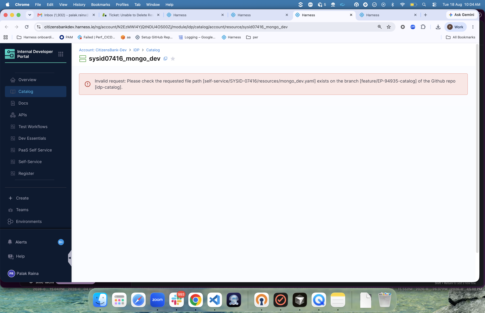

# TechDocs Image Link Test (IDP-10939)
[img src="image.png"](https://youtube.com)
This page tests that image-wrapped links render and navigate correctly.
## Exact repro

## Test Case 1: Empty src image before content images

<!-- This simulates MkDocs theme elements that may have empty src attributes -->

## Test Case 2: Regular image (should load after the empty-src above)

## Test Case 3: Image wrapped in a link (the reported bug)

Clicking the image below should navigate to the linked URL:

## Test Case 4: Image wrapped in a link (Markdown syntax)

## Test Case 5: Multiple images after empty src

These should all load correctly:

## Exact repro

## Expected Results

| Test Case | Before Fix | After Fix |
|-----------|------------|-----------|
| 1 | Empty img, no visible effect | Same (expected) |
| 2 | Image does NOT load (no network request) | Image loads from TechDocs storage |
| 3 | Image does NOT load, link unclickable | Image loads, clicking navigates to example.com/target-page |
| 4 | Image does NOT load, link unclickable | Image loads, clicking navigates to example.com/target-page |
| 5 | None of the images load | All images load |

## How to Verify

1. Publish this page to TechDocs.
2. Ensure `image.png` exists in the same `docs/` directory as `index.md`.
3. Open the published TechDocs page in a browser.
4. Open **DevTools → Network**.
5. Verify that requests for `image.png` are made to the TechDocs static asset endpoint.
6. Verify that the images render correctly.
7. Verify that clicking the image in Test Case 3 opens `https://example.com/target-page` in a new tab.
8. Verify that clicking the image in Test Case 4 navigates to the same URL.
